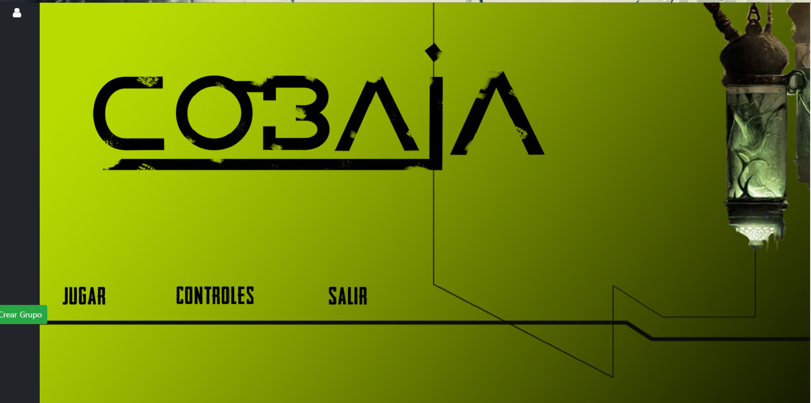
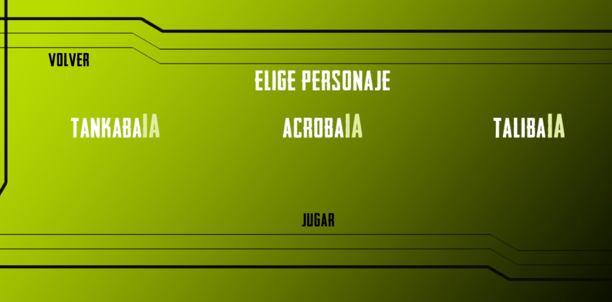

# CobaIA

NOMBRE DEL JUEGO:
<b>CobaIA</b>

<h2>DESCRIPCIÓN DEL JUEGO:</h2>

El juego se plantea como una aventura de puzzles y plataformas cooperativa. Los personajes principales son tres cobayas sometidas a un experimento en el que tres IA han tomado control de sus cerebros.
Estas deben luchar por escapar del lugar donde son retenidas y para ello deberán unir fuerzas aprovechando las habilidades únicas que posee cada una.

  

Cada nivel se plantea como un puzzle en sí mismo y la única forma de seguir avanzando hacia la libertad es funcionar como un equipo.
Sin embargo, conforme avance la aventura nuestras cobayas descubrirán pequeños fragmentos de quiénes son y dónde están realmente, lo que les hará dudar de hasta qué punto conocerse a sí mismo puede resultar peligroso.

<h2> INTERACCIÓN CON USUARIOS Y PERSPECTIVA: </h2>

Cada usuario controlará a una cobaya. Estará en cada nivel junto a sus compañeras para colaborar en el avance de los puzzles. La cámara se plantea con una vista de scroll-lateral que seguirá a un jugador a la ves y le permitirá observar su entorno en un pequeño radio. La cámara puede cambiar para enfocar a cualquiera de las otras dos CobaIAs en el momento que los jugadores lo deseen.

<h2> COBAIAS: </h2>

Cada cobaIA tendrá sus propias características físicas y habilidades:

<b>1. CobaIA tanque (TANKABAIA)</b>: Gracias a su complexión fuerte y su peso, esta robusta criatura puede soportar los flujos de aire de los ventiladores que harían volar a las demás. Sumado a esto, posee una fuerza natural que le permite mover objetos pesados como cajas. Por ello la <b>TANKABAIA</b> es el escudo y el músculo del equipo.

<b>2. CobaIA ágil (AGILBAIA)</b>: Gracias a su flexibilidad y cuerpo alargado esta cobaya posee un don natural para trepar por paredes. La <b>AGILBAIA</b> es la que se encarga de llegar a los lugares difíciles para facilitar el acceso a sus compañeras.

<b>3. CobaIA exploradora (SCOUTBAIA)</b>: Por último nuestra <b>SCOUTBAIA</b> es una cobaya de riesgos, la IA que le controla al no poseer un módulo de autopreservación, hace que tome decisiones de dudosa seguridad. Ella se lanza de cabeza a planear por el aire si necesita alcanzar plataformas lejanas a las que solo un mamífero de pequeñas dimensiones podría llegar. Además no tiene reparo en morder con sus poderosos dientes los cables de los sistemas electrónicos o las enredaderas con tal de despejar el camino.

<h2> ESTRUCTURA NARRATIVA: </h2>

El juego consta de dos fases:

<b>1. Zona de máquinas:</b>

<b>2. Laboratorio</b>

<h2> OBJETOS INTERACTUABLES: </h2>

Son los elementos con los que construiremos los niveles:

<b>1. Cajas:</b> Son objetos pesados y contundentes que sirven para activar placas de presión, sortear huecos, alcanzar alturas superiores y servir de barricada. Normalmente son las <b>TANKABAIAS</b> las encargadas de posicionar estos objetos.

<b>2. Bobinas:</b> Son elementos peligros que restringen el acceso a una zona y que de ser tocados pueden suponer la muerte de la cobaya.

<b>3. Ventiladores:</b> Los ventiladores los encontraremos posicionados en distintos lugares y según esta posición jugarán distintos roles. Pueden servir como trampas para atraer o empujar a las cobayas a lugares indeseados, como impulso para la <b>SCOUTBAIA</b> en sus vuelos o incluso como medida para restringir el acceso a una determinada área.

<b>4. Cadáveres de cobayas:</b> Las cobayas son meros instrumentos de las IA que les controlan, así que si una de ellas muere basta con implantar el chip que contiene a la IA en otra cobaya.

<b>5. Cajas de cableado:</b> Algunas compuertas estarán selladas electrónicamente y la única forma de poder atravesarlas será encontrando su caja de cableado, después una <b>SCOUTBAIA</b> deberá encargarse usar sus dientes para hacerlas un desastre y activar las compuertas.

<b>6. Compuertas:</b> compuertas.

<b>7. Botones:</b>..son solo botones.

<h2> GAME OVER: </h2>

Si un jugador muere, los demás jugadores podrán recuperar el chip de su IA. Una vez lo tengan, deberán buscar un cadáver de cobaya para su implante. De esta forma, la muerte de una de los jugadores puede provocar la del equipo entero si no se subsana. En caso de muerte de todo el equipo, se reiniciará el nivel. Además de todo esto, se incluirá un botón de reset paara poder reiniciar el nivel cuando quieras.

<h2> TUTORIAL: </h2>

El tutorial se hará mediante un primer nivel que permita a las CobaIAs experimentar con los distintos elmentos del juego.

<h2> DIAGRAMA DE CLASES: </h2>

Se puede destacar 2 Controladores que se encargan de manejar las dos clases que utilizaremos en un futuro, Version e Item.
  También mostrar que <b> Versiones e Item heredan de los controladores</b>. No hemos utilizado templates ni tampoco 
  repositorios, ya que utilizamos una <b>colección</b> para guardar permanentemente los datos en la ejecución. 

<h2> SISTEMA DE NAVEGACIÓN: </h2>

Lo primero que encontraremos será el <b>Inicio de Sesión</b>. En él podremos guardar nuestro nombre de usuario y ver 
los usuarios que hay conectados en la parte lateral izquierda. Se deberá hacer un grupo para poder jugar 3 personas, dandole
al boton izquierdo inferior.

A continuación veremos el <b>Menu Principal</b>, donde se apreciará tres opciones a elegir, 1. Jugar, 2.Controles, 3.Salir.

Si pinchamos en <b>Controles </b>podremos ver dos imagenes donde se mostrarán todos los controles necesarios para jugar, y los
perifericos que se pueden utilizar. Si se pincha en volver, retrocederemos al menu principal. 

Una vez accedido a la opción Jugar, te saldrá un menu de <b>Elegir personaje</b> para que cada jugador pueda elegir su personaje favorito. 

Como ya se mostró en la fase anterior, el gameplay, donde se podrá jugar al videojuego.

En caso de que se supere el videojuego, saldrá un mensaje de gracias por jugar, y se reiniciará el juego

<h2>INSTRUCCIONES PRECISAS PARA EJECUTAR LA APLICACION:</h2>

Para ejecutar la aplicación basta sencillamente con ir a la consola de comandos de Windows y movernos a la carpeta contenedora del jar (CobaIA/target/) y ejecutar la línea de comando "java -jar items-backend-and-frontend-0.0.1-SNAPSHOT.jar".

Para acceder a la aplicación basta con introducir en el navegador la url "localhost:8080" y ya podremos empezar a jugar.

<h2>REFERENCIAS:</h2>

Hollow Knight, Inside, Ori Blind Forest.

<b>INTEGRANTES DEL EQUIPO</b>
- Nombre: Mario Fernández Fernández	
- E-mail: m.fernandezfer.2016@alumnos.urjc.es
- Enlace GitHub: https://github.com/marferfer 

- Nombre: Luis Betancourt Ortega
- E-mail: le.betancourt@alumnos.urjc.es
- Enlace GitHub: https://github.com/LuisCheek  

- Nombre: Javier Barbas Cubero
- E-mail: j.barbas.2016@alumnos.urjc.es
- Enlace GitHub: https://github.com/JBarbas

Dirección de Trello:
https://trello.com/b/ONtmcols/juegosenred

<h3>Todos los derechos reservados</h3>

 
